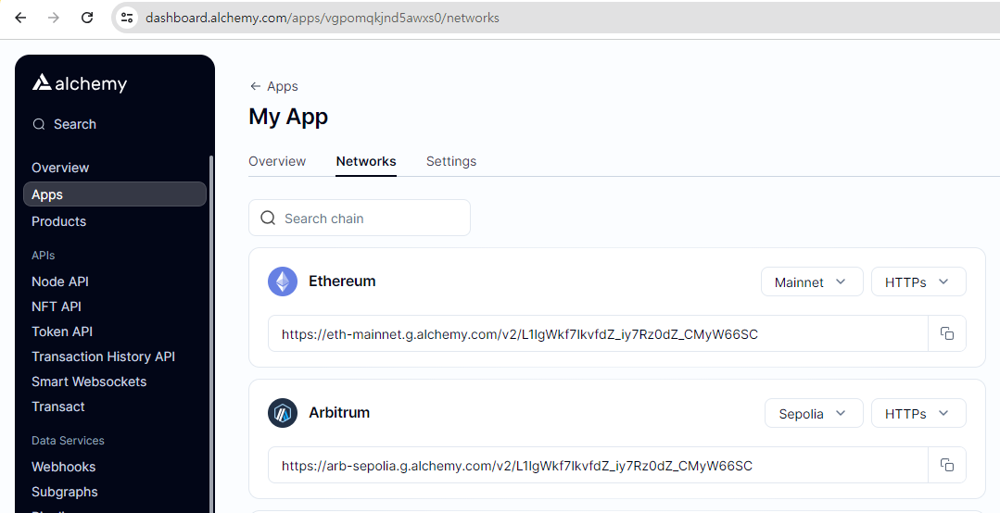
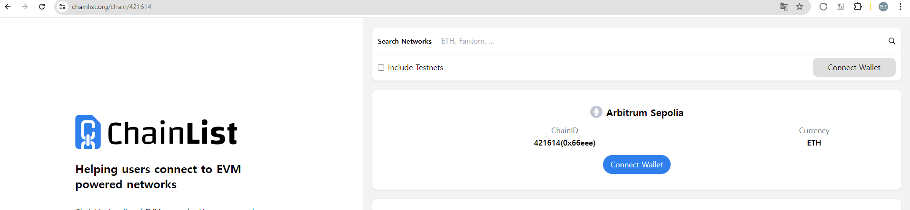
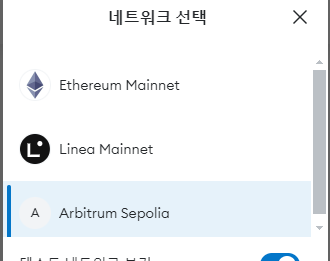
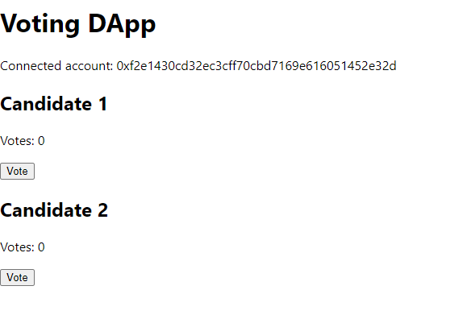

# Arbitrum Voting Dapp
- 참고 : https://github.com/OffchainLabs/arbitrum-tutorials/tree/master/packages/demo-dapp-election
- 위의 깃에서 투표 디앱의 기능을 참고하여 프론트엔드랑 결합하여 구현하였다.

<br/>

node: v20.11.0

## 목표
- Arbitrum Sepolia Network에 스마트 컨트랙트를 배포한다.
- 프론트엔드로 보팅 앱을 구현하며, 메타마스크 연결과, 해당 스마트컨트랙트를 이용한 투표 앱을 구현한다.

<br/>

## React 프로젝트 생성

```shell
npx create-react-app arbitrum-voting-dapp
```

<br/>

package.json 의존성 추가.

```json
{
  "devDependencies": {
    "@nomiclabs/hardhat-ethers": "^2.0.2",
    "chai": "^4.3.4",
    "ethers": "^5.1.2",
    "hardhat": "^2.2.0"
  },
  "dependencies": {
    "arb-shared-dependencies": "^1.0.0",
    "dotenv": "^8.2.0"
  }
}
```

<br/>

의존성 설치

```shell
npm install
```


## hardhat 설정
hardhat.config.js
```js
require('@nomiclabs/hardhat-ethers')

const { hardhatConfig } = require('arb-shared-dependencies')

module.exports = hardhatConfig
```

<br/>

## 스마트 컨트랙트 작성

contracts/Election.sol
```
pragma solidity ^0.7.0;

contract Election {
    // Model a Candidate
    struct Candidate {
        uint256 id;
        string name;
        uint256 voteCount;
    }

    // Store accounts that have voted
    mapping(address => bool) public voters;
    // Store Candidates
    // Fetch Candidate
    mapping(uint256 => Candidate) public candidates;
    // Store Candidates Count
    uint256 public candidatesCount;

    // voted event
    event votedEvent(uint256 indexed _candidateId);

    constructor() public {
        addCandidate("Candidate 1");
        addCandidate("Candidate 2");
    }

    function addCandidate(string memory _name) private {
        candidatesCount++;
        candidates[candidatesCount] = Candidate(candidatesCount, _name, 0);
    }

    function vote(uint256 _candidateId) public {
        // require that they haven't voted before = 투표한 사람은 다시 못하는 정책.
        require(!voters[msg.sender]);

        // require a valid candidate
        require(_candidateId > 0 && _candidateId <= candidatesCount);

        // record that voter has voted
        voters[msg.sender] = true;

        // update candidate vote Count
        candidates[_candidateId].voteCount++;

        // trigger voted event
        emit votedEvent(_candidateId);
    }
}
```


## 배포 스크립트 작성
scripts/deploy.js
```js
import {ethers} from "ethers";

async function main() {
  const [deployer] = await ethers.getSigners();

  console.log("Deploying contracts with the account:", deployer.address);

  const Election = await ethers.getContractFactory("Election");
  const election = await Election.deploy();

  console.log("Election contract deployed to:", election.address);
}

main()
  .then(() => process.exit(0))
  .catch((error) => {
    console.error(error);
    process.exit(1);
  });
```


## env 설정

.env-sample 파일명을 .env로 변경 후, 설정 값들을 삽입한다.

.env
```
# This is a sample .env file for use in local development.
# Duplicate this file as .env here

# Your Private key
DEVNET_PRIVKEY="0x your key here"

# Hosted Aggregator Node (JSON-RPC Endpoint). This is Arbitrum Sepolia Testnet, can use any Arbitrum chain
L2RPC="https://sepolia-rollup.arbitrum.io/rpc"
```

## L2 RPC
Alchemy를 사용하여 앱을 만든 후, Arbitrum Sepolia의 https 주소를 입력하면 된다.



## 스마트 컨트랙트 배포
솔리디티 컴파일 후, l2 네트워크에 배포하게 된다.

```shell
npx hardhat run scripts/deploy.js --network l2
```

contracts/Election.sol: Warning: SPDX license identifier not provided in source file. Before publishing, consider adding a comment containing "SPDX-License-Identifier: <SPDX-Licens
e>" to each source file. Use "SPDX-License-Identifier: UNLICENSED" for non-open-source code. Please see https://spdx.org for more information.

contracts/Election.sol:22:5: Warning: Visibility for constructor is ignored. If you want the contract to be non-deployable, making it "abstract" is sufficient.
constructor() public {
^ (Relevant source part starts here and spans across multiple lines).

Compiled 1 Solidity file successfully (evm target: istanbul).
Deploying contracts with the account: 0xf2E1430cD32EC3cfF70CBD7169E616051452e32D
Election contract deployed to: 0x2Ed9eD08106602FF7e507462F17340f1a308E241


<br/>

실행하게되면, artifacts/contracts/Election.sol/Election.json 파일이 생긴다 이 파일을
src/contracts/Election.json으로 복사한다.


## 리액트 앱 구현 (프론트엔드)
src/App.js를 구현하며  contractAddress에는 위에서 나왔던 배포된 컨트랙트 주소인 0x2Ed9eD08106602FF7e507462F17340f1a308E241를 삽입한다.

```js
import React, { useState, useEffect } from 'react';
import { ethers } from 'ethers';
import Election from './contracts/Election.json';

function App() {
  const [candidates, setCandidates] = useState([]);
  const [voted, setVoted] = useState(false);
  const [account, setAccount] = useState(null);
  const [loading, setLoading] = useState(true);
  const [error, setError] = useState(null);

  const provider = new ethers.providers.Web3Provider(window.ethereum);
  const signer = provider.getSigner();
  const contractAddress = '0x6Daf25EbAD3B0d8d4734E3cc2345E12a94746bc5'; // 배포된 컨트랙트 주소
  const contract = new ethers.Contract(contractAddress, Election.abi, signer);

  useEffect(() => {
    async function connectMetaMask() {
      if (window.ethereum) {
        try {
          const accounts = await window.ethereum.request({ method: 'eth_requestAccounts' });
          setAccount(accounts[0]);
          console.log('Connected account:', accounts[0]);
        } catch (error) {
          console.error('MetaMask connection error:', error);
          setError('Failed to connect to MetaMask');
        }
      } else {
        console.error('MetaMask is not installed');
        setError('MetaMask is not installed');
      }
    }

    connectMetaMask();
  }, []);

  useEffect(() => {
    if (window.ethereum) {
      window.ethereum.on('accountsChanged', (accounts) => {
        setAccount(accounts[0]);
        setError(null);
        console.log('Account changed:', accounts[0]);
      });

      window.ethereum.on('chainChanged', (chainId) => {
        window.location.reload();
      });
    }
  }, []);

  const fetchCandidates = async () => {
    if (!account) return;

    try {
      const candidatesCount = await contract.candidatesCount();
      console.log('Candidates Count:', candidatesCount.toNumber());
      let candidatesArray = [];
      for (let i = 1; i <= candidatesCount; i++) {
        let candidate = await contract.candidates(i);
        candidatesArray.push({
          id: candidate.id.toNumber(),
          name: candidate.name,
          voteCount: candidate.voteCount.toNumber()
        });
        console.log('Fetched candidate:', {
          id: candidate.id.toNumber(),
          name: candidate.name,
          voteCount: candidate.voteCount.toNumber()
        });
      }
      setCandidates(candidatesArray);
      setLoading(false);
      console.log('Candidates:', candidatesArray);
    } catch (error) {
      console.error('Error fetching candidates:', error);
      setError('Error fetching candidates');
      setLoading(false);
    }
  };

  useEffect(() => {
    fetchCandidates();
  }, [account]);

  const vote = async (candidateId) => {
    try {
      await contract.vote(candidateId);
      setVoted(true);
      fetchCandidates(); // 투표 후 후보자 데이터 다시 불러오기
    } catch (error) {
      console.error('Error voting:', error);
      setError('Error voting');
    }
  };

  const reconnectMetaMask = async () => {
    try {
      const accounts = await window.ethereum.request({ method: 'eth_requestAccounts' });
      setAccount(accounts[0]);
      setError(null);
      console.log('Reconnected account:', accounts[0]);
    } catch (error) {
      console.error('MetaMask connection error:', error);
      setError('Failed to reconnect to MetaMask');
    }
  };

  return (
    <div>
      <h1>Voting DApp</h1>
      {error && <p style={{ color: 'red' }}>{error}</p>}
      {account ? (
        loading ? (
          <p>Loading candidates...</p>
        ) : (
          <div>
            <p>Connected account: {account}</p>
            {candidates.map((candidate) => (
              <div key={candidate.id}>
                <h2>{candidate.name}</h2>
                <p>Votes: {candidate.voteCount}</p>
                <button onClick={() => vote(candidate.id)} disabled={voted}>
                  Vote
                </button>
              </div>
            ))}
          </div>
        )
      ) : (
        <div>
          <p>Please connect to MetaMask</p>
          <button onClick={reconnectMetaMask}>Reconnect MetaMask</button>
        </div>
      )}
    </div>
  );
}

export default App;
```


## React App 실행

```shell
npm start
```

<br/>

아비트럼 새폴리아 네트워크로 전환해야 이용할 수 있다.

https://chainlist.org/chain/421614 에서 아비트럼 새폴리아 네트워크를 추가하고 지갑에 연결 후




네트워크를 전환해야  비로소 해당 네트워크에서 스마트컨트랙트를 사용하여 App을 실행할 수 있다. <br/>


